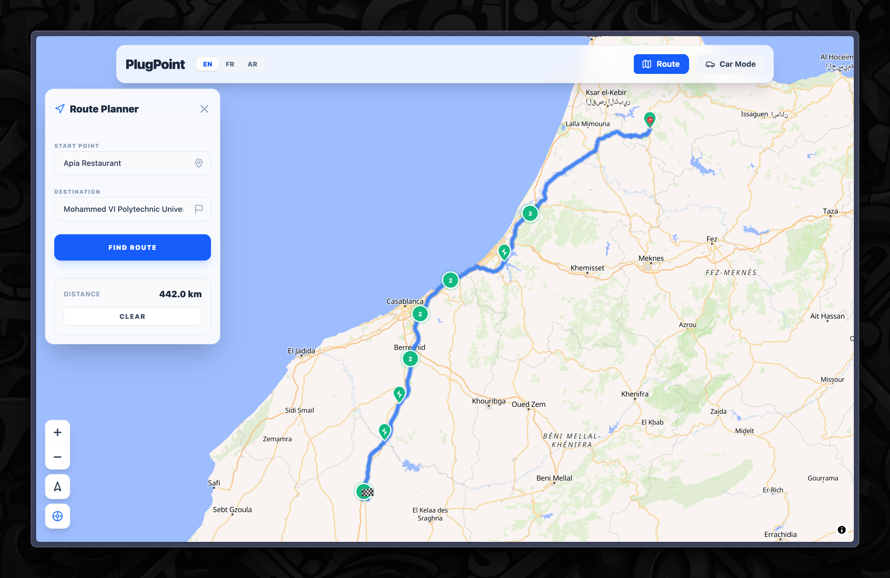

# ⚡ PlugPoint | EV Charging & Smart Routing



PlugPoint is a high-performance, professional EV charging station locator and route planning application. Designed for both desktop and in-vehicle displays, it provides real-time information on charging infrastructure, intelligent route planning based on vehicle specifications, and a specialized "Car Mode" for distraction-free navigation.

## 🚀 Key Features

### 🗺️ Advanced Map Interface
- **Interactive Mapping**: Powered by MapLibre GL JS with high-quality vector tiles.
- **Dynamic Clustering**: Efficiently visualize thousands of charging stations with smart clustering.
- **Real-time Markers**: Custom-designed SVG markers representing different charger types and availability.

### 🔋 Intelligent Route Planning
- **Range Simulation**: Plan trips based on your vehicle's current battery level and range.
- **Station Integration**: Automatically suggest charging stops along your route.
- **Geospatial Logic**: Built with Turf.js for accurate distance and time calculations.

### 🚗 Professional Car Mode
- **High-Visibility UI**: Optimized for in-vehicle tablets and consoles with large touch targets and high contrast.
- **Persistent State**: Maintains your route and vehicle configuration throughout the session.
- **Responsive Panels**: Seamless transition between information-rich desktop views and focused mobile/tablet layouts.

### 🚙 Vehicle Management
- **Extensive Database**: Integrated with Chargetrip for detailed vehicle specs (battery capacity, connector types, efficiency).
- **Vehicle Picker**: Sleek modal interface to select and switch between EV models.

## 🛠️ Tech Stack

- **Frontend**: [React 19](https://react.dev/) + [Vite](https://vitejs.dev/)
- **Styling**: [Tailwind CSS 4](https://tailwindcss.com/)
- **State Management**: [Zustand](https://github.com/pmndrs/zustand)
- **Geospatial**: [MapLibre GL JS](https://maplibre.org/) & [Turf.js](https://turfjs.org/)
- **Icons**: [Lucide React](https://lucide.dev/)
- **API Integrations**: OpenChargeMap & Chargetrip

## 🏁 Getting Started

### Prerequisites
- Node.js (Latest LTS recommended)
- npm or yarn

### Installation

1. **Clone the repository**
   ```bash
   git clone <repository-url>
   cd plugpoint
   ```

2. **Install dependencies**
   ```bash
   npm install
   ```

3. **Configure Environment Variables**
   Create a `.env` file in the root directory:
   ```env
   VITE_OPENCHARGEMAP_KEY=your_key_here
   VITE_CHARGETRIP_CLIENT_ID=your_id_here
   VITE_CHARGETRIP_APP_ID=your_app_id_here
   VITE_ENABLE_REPORTS=false
   ```

4. **Start Development Server**
   ```bash
   npm run dev
   ```

### 🐳 Docker Support

Run the application using Docker Compose:
```bash
docker-compose up --build
```

## 📂 Project Structure

```text
src/
├── components/     # UI Components (Map, Panels, Detail views)
├── hooks/          # Custom React hooks
├── store/          # Zustand state management
├── utils/          # Geospatial and API utilities
├── assets/         # Static assets
└── App.jsx         # Main application entry
```

## ⚖️ License

Distributed under the MIT License. See `LICENSE` for more information.

---

*Developed as a professional EV Infrastructure solution.*
